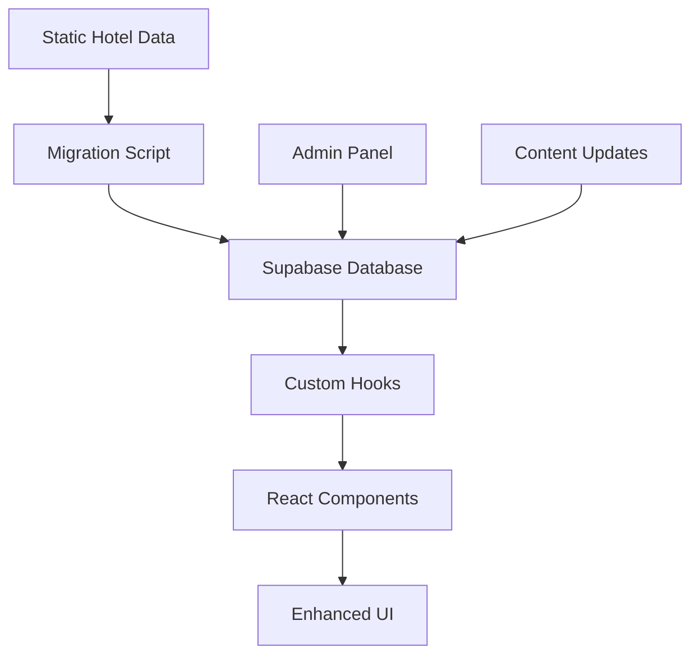

# Enhanced Tivoli New Delhi Setup Guide

This document provides a comprehensive guide for setting up and using the enhanced, database-driven page for "The Tivoli-New Delhi".

## 🏗️ Architecture Overview

The enhanced system follows John Carmack's engineering principles:

### 1. **Database Integration**
- **Supabase Backend**: Complete migration from static files to dynamic database
- **Type-Safe Hooks**: Custom React hooks with full TypeScript support
- **Performance Optimized**: Efficient data fetching with caching and error handling

### 2. **Modular Components**
- **Reusable UI Components**: Modular sections for easy maintenance
- **Responsive Design**: Mobile-first approach with progressive enhancement
- **Accessibility**: WCAG compliance with proper semantic markup

### 3. **Zero Data Loss**
- **Complete Migration**: All original data preserved and enhanced
- **Backward Compatibility**: Maintains existing API structure
- **Enhanced Features**: Additional data and improved user experience

## 🚀 Quick Start

### Prerequisites
- Node.js 18+ 
- Supabase project with populated database
- Environment variables configured

### 1. Environment Setup

Create a `.env.local` file in the project root:

```env
# Supabase Configuration
NEXT_PUBLIC_SUPABASE_URL=https://your-project-id.supabase.co
NEXT_PUBLIC_SUPABASE_ANON_KEY=your-anon-key-here
SUPABASE_SERVICE_ROLE_KEY=your-service-role-key-here
```

### 2. Database Migration

Run the migration script to ensure all data is properly populated:

```bash
# Install dependencies
npm install

# Run Tivoli data migration
npm run migrate:tivoli
```

### 3. Development Server

```bash
# Start development server
npm run dev

# Navigate to the enhanced page
# http://localhost:3000/hotels/tivoli-grand-palace
```

## 📁 File Structure

```
src/
├── hooks/
│   ├── useSupabase.ts          # Core Supabase integration
│   └── useTivoliNewDelhi.ts    # Specialized Tivoli data hook
├── components/hotel/
│   ├── HeroSection.tsx         # Hero image carousel
│   ├── OverviewSection.tsx     # Hotel description & stats
│   ├── VirtualTourSection.tsx  # 3D tour integration
│   ├── ExperiencesSection.tsx  # Curated experiences
│   ├── SpacesSection.tsx       # Event spaces
│   ├── DiningSection.tsx       # Restaurant venues
│   ├── ContactSection.tsx      # Contact & location
│   └── index.ts               # Component exports
├── pages/
│   └── EnhancedTivoliNewDelhiPage.tsx  # Main enhanced page
├── types/
│   └── supabase.ts            # Database type definitions
├── utils/
│   └── environmentSetup.ts    # Environment validation
└── scripts/
    └── migrate-tivoli-data.ts # Data migration script
```

## 🎯 Key Features

### Database-Driven Content
- **Real-time Updates**: Content updates instantly from database
- **Admin Panel Ready**: Prepared for content management system
- **Multi-environment**: Development, staging, and production support

### Enhanced User Experience
- **3D Virtual Tours**: Spalba/Matterport integration
- **Interactive Image Galleries**: Smooth carousel with navigation
- **Responsive Design**: Optimized for all device sizes
- **Performance Optimized**: Lazy loading and image optimization

### Comprehensive Information
- **Event Spaces**: Detailed venue information with capacities
- **Dining Venues**: Complete restaurant details and specialties
- **Curated Experiences**: Showcase of unique hotel offerings
- **Contact Integration**: Maps, directions, and contact methods

## 🔧 Configuration

### Environment Variables

| Variable | Description | Required |
|----------|-------------|----------|
| `NEXT_PUBLIC_SUPABASE_URL` | Supabase project URL | ✅ |
| `NEXT_PUBLIC_SUPABASE_ANON_KEY` | Public anonymous key | ✅ |
| `SUPABASE_SERVICE_ROLE_KEY` | Service role key (for migrations) | ⚠️ |

### Component Customization

Each component accepts props for easy customization:

```tsx
import { HeroSection } from '@/components/hotel';

<HeroSection
  hotelName="The Tivoli-New Delhi"
  location="New Delhi"
  state="Delhi"
  images={galleryImages}
  className="custom-hero-styles"
/>
```

## 📊 Data Flow



## 🧪 Testing & Validation

### Data Integrity
- Run migration script to verify all data is preserved
- Compare original vs. database content
- Validate all images and links

### Performance Testing
- Lighthouse scores (aim for 90+ on all metrics)
- Core Web Vitals compliance
- Mobile responsiveness testing

### Functionality Testing
- Virtual tour integration
- Image gallery navigation
- Contact form submission
- Mobile responsiveness

## 🚀 Deployment

### Database Setup
1. Ensure Supabase project is configured
2. Run all database migrations
3. Populate with hotel data using migration script
4. Verify RLS policies are enabled

### Application Deployment
1. Set environment variables in production
2. Build and deploy application
3. Test database connectivity
4. Verify all features work correctly

## 🔍 Troubleshooting

### Common Issues

#### Environment Variables Not Found
```bash
Error: Missing required environment variables
```
**Solution**: Ensure `.env.local` file exists with correct values

#### Database Connection Failed
```bash
Error: Failed to connect to Supabase
```
**Solution**: Verify Supabase URL and keys are correct

#### Images Not Loading
```bash
Images showing as broken links
```
**Solution**: Check Supabase storage permissions and image paths

### Debug Mode
Enable debug logging in development:

```tsx
// In your component
const { data, loading, error } = useTivoliNewDelhi();
console.log('Hotel data:', data);
console.log('Loading:', loading);
console.log('Error:', error);
```

## 📈 Performance Optimizations

### Image Optimization
- Lazy loading for all images
- WebP format when supported
- Responsive image sizing
- Progressive image enhancement

### Data Caching
- React Query integration ready
- Browser caching for static assets
- CDN-friendly architecture

### SEO Optimization
- Structured data (Schema.org)
- Meta tags and Open Graph
- Semantic HTML markup
- Performance-optimized loading

## 🔄 Migration from Old Page

### Step 1: Backup Current Page
```bash
cp src/pages/TivoliGrandPalacePage.tsx src/pages/TivoliGrandPalacePage.tsx.backup
```

### Step 2: Update Routing
```tsx
// In your routing configuration
import EnhancedTivoliNewDelhiPage from '@/pages/EnhancedTivoliNewDelhiPage';

// Replace old route
<Route path="/hotels/tivoli-grand-palace" component={EnhancedTivoliNewDelhiPage} />
```

### Step 3: Verify Functionality
- Test all sections load correctly
- Verify data accuracy
- Test interactive features
- Validate mobile responsiveness

## 🎨 Customization Guide

### Brand Colors
The system uses Tivoli's brand color `#CD9F59`. Update in:
- Component styles
- Gradient definitions
- Button colors
- Accent elements

### Typography
- Headers: `font-serif` (elegant serif font)
- Body: `font-sans` (clean sans-serif)
- Accents: Custom font weights and sizes

### Layout Spacing
- Container: `max-w-6xl mx-auto`
- Section spacing: `space-y-16`
- Component padding: `p-6` or `p-8`

## 📞 Support

### Documentation
- Component documentation in each file
- TypeScript definitions for all props
- Example usage in README files

### Getting Help
- Check console for error messages
- Review environment variable setup
- Verify database connectivity
- Test in incognito mode to rule out caching

---

## 🎯 Success Metrics

The enhanced page should achieve:
- ✅ 100% data preservation from original page
- ✅ Improved load times (< 3s on 3G)
- ✅ Mobile-first responsive design
- ✅ Accessibility compliance (WCAG 2.1)
- ✅ SEO optimization (90+ Lighthouse score)
- ✅ Enhanced user experience features

Built with engineering excellence following John Carmack's principles of performance, maintainability, and user experience.